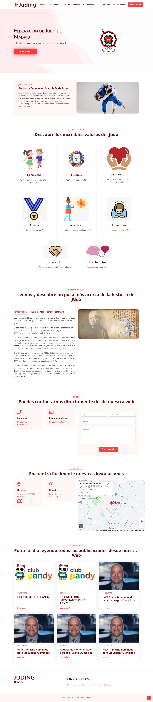
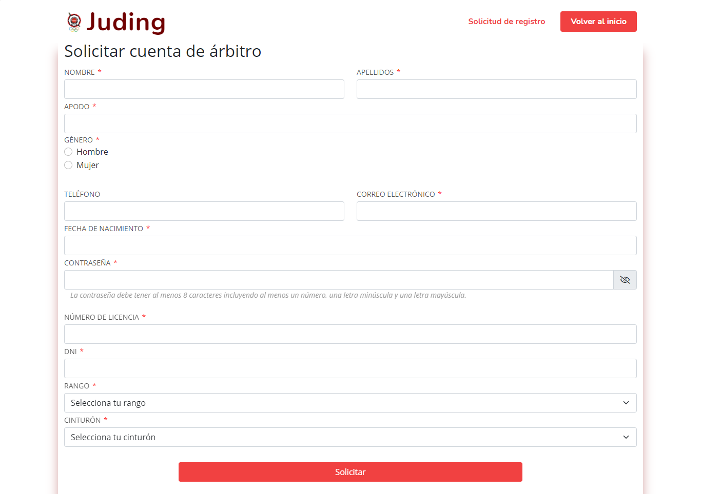
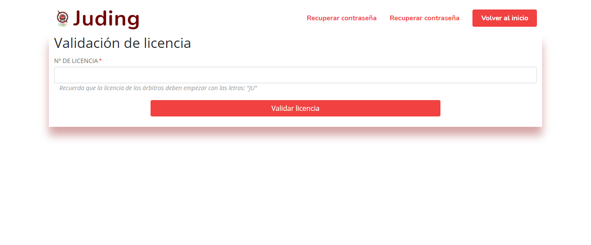
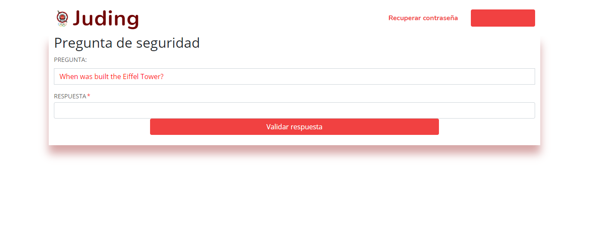
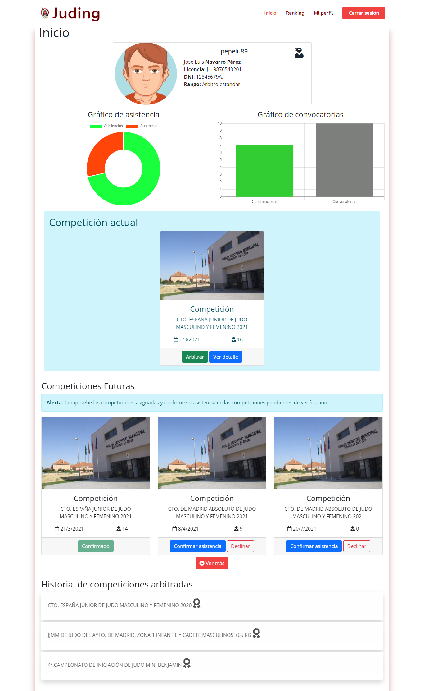
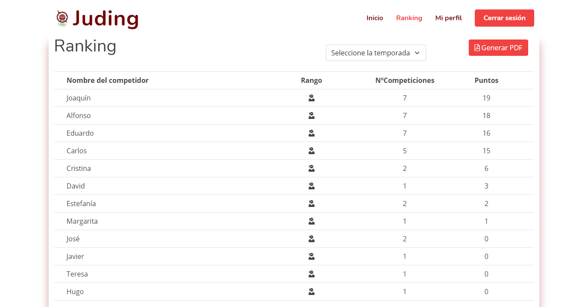

# JUDING

**JUDO FEDERATION OF MADRID**

This application try to replace the [official website](https://www.fmjudo.es/) of Judo Federation of Madrid, adding new
tools for competitions, competitors and referees management. In order to unify the diferents existing tools such as the
register of the differents kinds of users and the monitoring of the results of the competitions.

## The team: developers

| Full Name | Corporative email | Github nickname |
| - | - | - |
| Ismael González Sastre | i.gonzalezs.2018@alumnos.urjc.es | [Ismaelgzse](https://github.com/Ismaelgzse) |
| Diego Guerrero Carrasco | d.guerrero.2018@alumnos.urjc.es | [diego-guerrero](https://github.com/diego-guerrero) |
| Alberto Pérez Pérez | a.perezpe.2018@alumnos.urjc.es | [C0nf1cker](https://github.com/C0nf1cker) |
| José Luis Toledano Díaz | jl.toledano.2018@alumnos.urjc.es | [jolutoher18](https://github.com/jolutoher18) |

The group is organised using the Trello tool. Our board can be viewed here: [Trello](https://trello.com/b/rGpiD6eO/daw-grupo-2).

___

## Stage 0: project description

### Entities

* **User**. Users are the *cornerstone* of our application. There are different types of users and all of them are part
  of this great community.
* **Competitions**. Competitions are the tournaments where competitors fight. There are a lot of competitions for many
  people: for kids, for young people and for adults.
* **Fight**. Competitions are made of fights. Each bout is played with two competitors and there is one referee per
  fight.
* **Post**. All types of users will be able to see small news items about the world of judo and recent activities on the
  same topic on the main page of the application.

### User roles and permissions

* **Unregistered users**. Anonymous users can read generic information about judo and about the Federation.
* **Competitors**. These users are able to ask for playing in a competition and to see the raffle for the competitions.
  Furthermore, they can see their own profile with their personal information and competition history.
* **Referees**. These users can assign points when they are refereeing a fight. They can also see their personal
  information and a history of fights refereed in their own profiles.
* **Administrator**. This user has the *absolute* control of the application, with capacities like:
    * Grant access to referees (their sign up process must be confirmed).
    * Create, modify and delete competitions.
    * Modify and delete competitors.

### Images

* The application **administrator** will be able to set a big image to represent each competition.
* Referees and competitors will have an avatar image (they will be able to change and delete it whenever they want).
  Having a profile image is compulsory to take part in a competition (both for competitors and for referees).

### Graphics

There will be shown two different graphics:

* Line graph showing the evolution during past competitions of each competitor.
* Bar graph with the number of bronze, silver and gold medals obtained during past competitions.

### Complementary technology

* The application will generate assistance justifications in PDF format.
* The ranking of a competition can be exported as PDF.
* Users will receive an e-mail verification when signing up in the application.
* Referees will receive an e-mail verification when their applications are solved (even if are accepted or if are
  rejected).

### Advanced algorithm

* When the result of a fight is sent by a referee, the clasification score and tree will be automatically updated.
* The bar chart of medals (and the amount of medals obtained) will be dynamically obtained by comparing the results of
  each competition and resolving by the result if the competitor had scored 1st, 2nd or in any of the 3rd positions.

---

## Stage 1: Layout of pages with HTML and CSS (*frontend*)

The different screens that make up this web application have been coded with a letter and two digits according to the
following criteria.

* A-XX: Screens that can be viewed by all types of users (registered and unregistered).
* CR-XX: Screens that can be seen by competitors and referees.
* C-XX: Screens that competitors can see.
* R-XX: Screens that referees can see.

### Screens

The application consists of the following screens:

* A-01: Homepage.
  
* A-02: Terms and conditions of use.
  
* A-03: Cookies policy.
  
* A-04: Login.
  
* A-05: Competitors' registration.
  
* A-06: Referee registration.
  
* CR-01: License validation. First step to change a user's password.
  
* CR-02: Security question. Second step to change a user's password.
  
* CR-03: Password change. Last step to change a user's password.
  
* CR-04: Competition information. This screen reflects the details of a competition as well as the draw for the
  competition, the results and the venue.
  
* C-01: Competitors' homepage. On this page you can see some details of their profile, their statistics and the
  competitions they can enter or have already entered.
  
* C-02: Ranking of competitors.
  
* C-03: Competitor profile.
  
* C-04: Modification of data. In this screen competitors can change some of the aspects of their own profile.
  
* R-01: Referees' homepage. On this page you can see some details of their profile, their statistics and the
  competitions they can enter or have already entered.
  
* R-02: Ranking of competitors.
  
* R-03: Referee profile.
  
* R-04: Modification of data. In this screen referees can change some of the aspects of their own profile.
  
* R-05: Combat control panel. The referee can manage from here by recording the scores and controlling the fight times.
  

### Navigation diagram

The following diagram shows how different users can navigate through the different pages of the application according to
their role.

