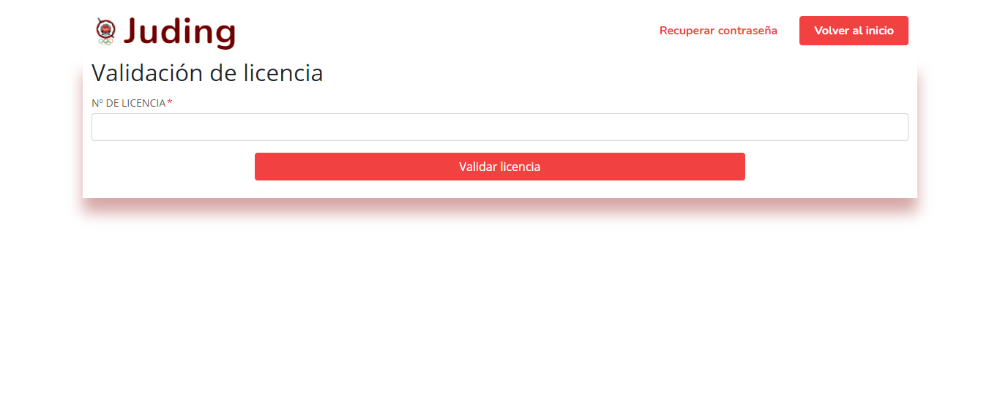
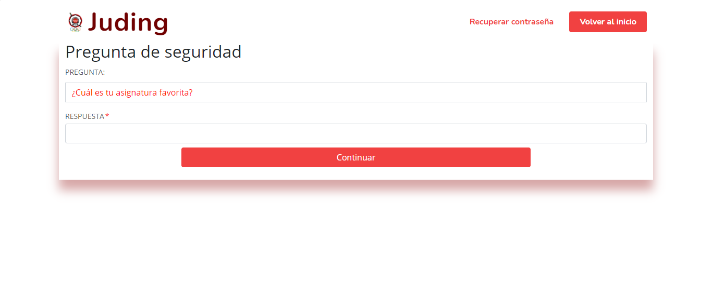
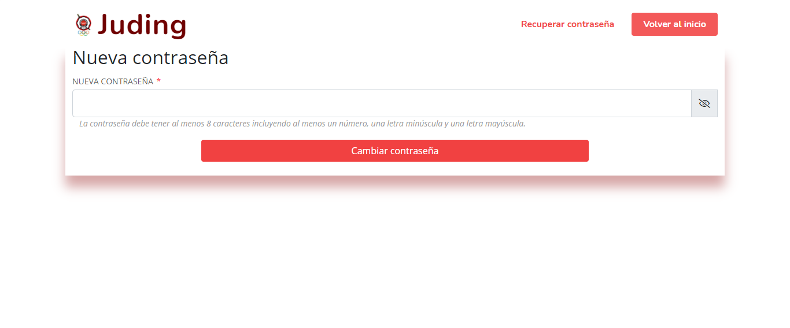
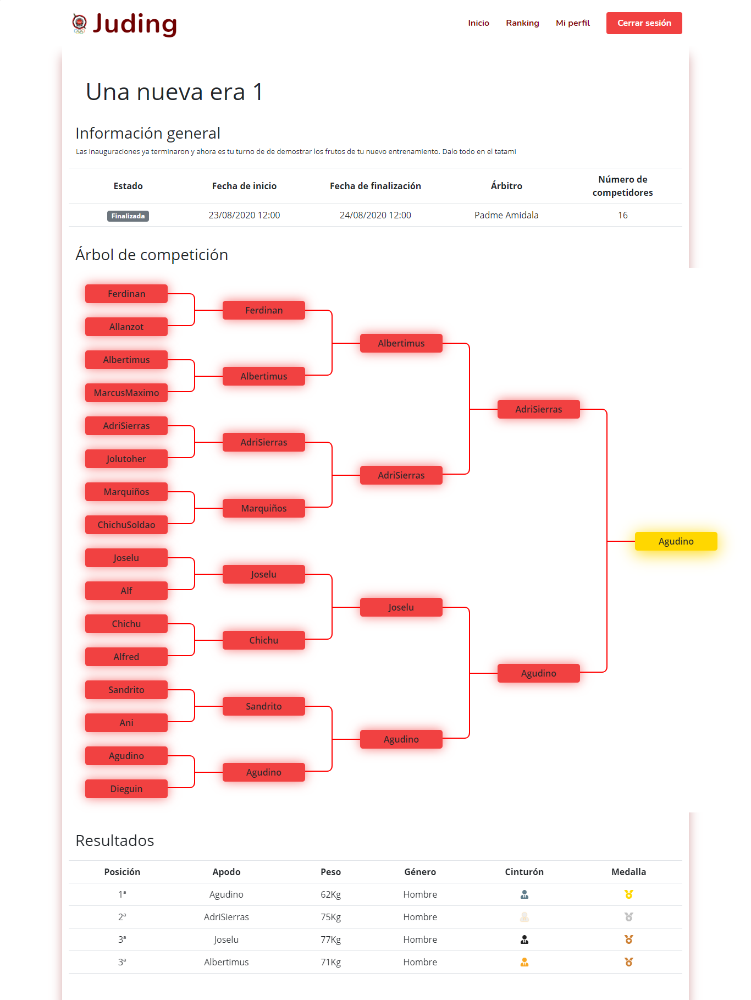
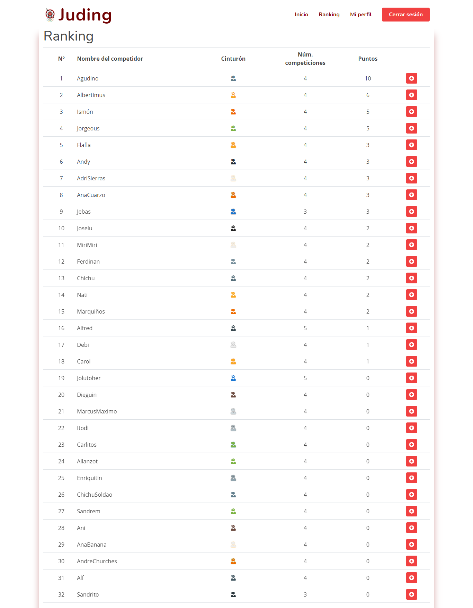
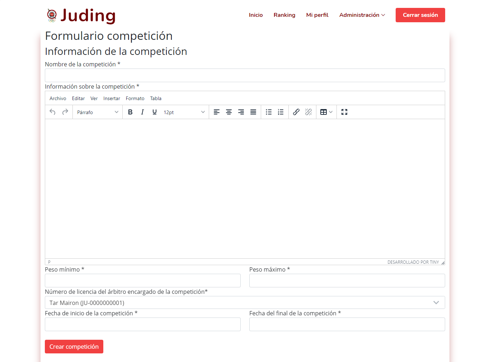
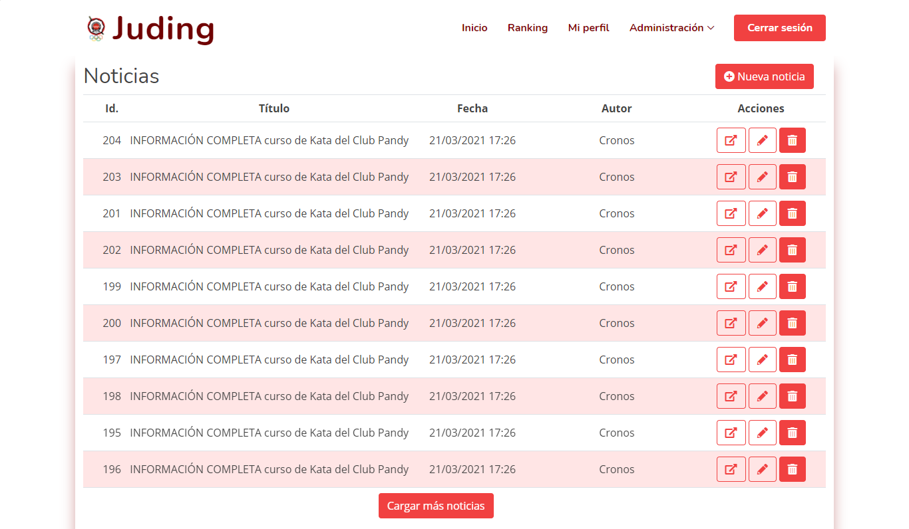
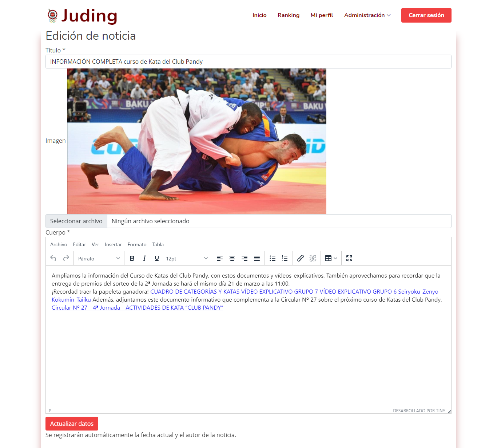
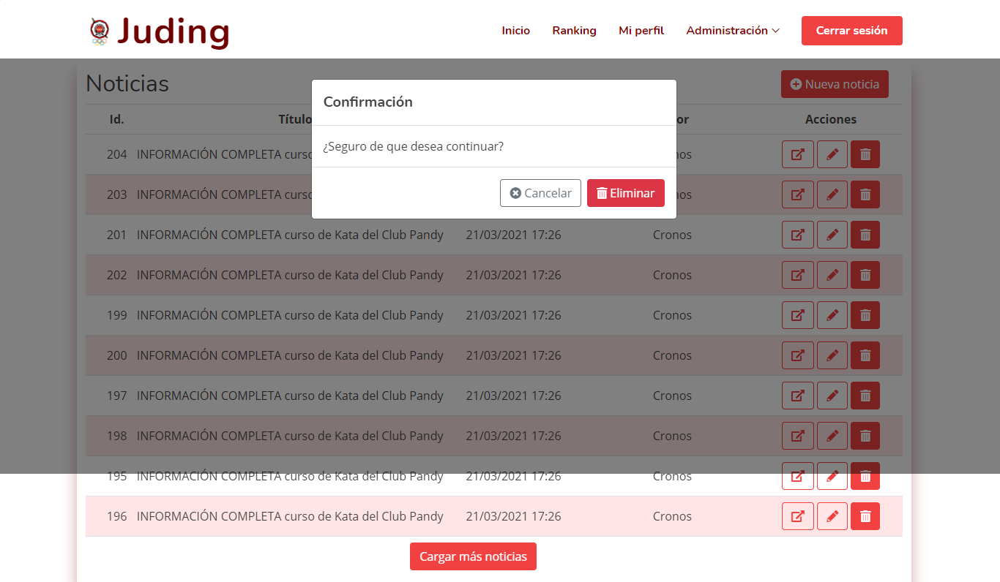
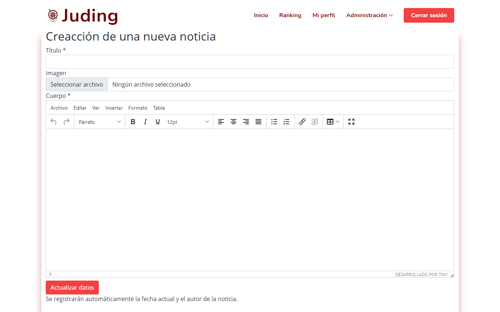

# JUDING


**JUDO FEDERATION OF MADRID**

This application try to replace the [official website](https://www.fmjudo.es/) of Judo Federation of Madrid, adding new
tools for competitions, competitors and referees management. It pretends to unify the different existing tools such as the
register of the different kinds of users and the monitoring of the results of the competitions.

**VIDEO (stage 4)**
PENDING.

## The team: developers

| Full Name | Corporative email | Github nickname |
| - | - | - |
| Ismael González Sastre | i.gonzalezs.2018@alumnos.urjc.es | [Ismaelgzse](https://github.com/Ismaelgzse) |
| Diego Guerrero Carrasco | d.guerrero.2018@alumnos.urjc.es | [diego-guerrero](https://github.com/diego-guerrero) |
| Alberto Pérez Pérez | a.perezpe.2018@alumnos.urjc.es | [C0nf1cker](https://github.com/C0nf1cker) |
| José Luis Toledano Díaz | jl.toledano.2018@alumnos.urjc.es | [jolutoher18](https://github.com/jolutoher18) |

The group is organised using the Trello tool. Our board can be viewed here: [Trello](https://trello.com/b/rGpiD6eO/daw-grupo-2).

___

## Stage 0: project description

### Entities

* **Users**. Users are the *cornerstone* of our application. There are different types of users and all of them are part
  of this great community.
* **Competitions**. Competitions are the tournaments where competitors fight. There are a lot of competitions for many
  people: for kids, for young people and for adults.
* **Fights**. Competitions are made of fights. Each bout is played with two competitors and there is one referee per
  fight.
* **Posts**. All types of users will be able to see small news items about the world of judo and recent activities on the
  same topic on the main page of the application.

### User roles and permissions

* **Unregistered users**. Anonymous users can read generic information about judo and about the Federation.
* **Competitors**. These users are able to ask for playing in a competition and to see the raffle for the competitions.
  Furthermore, they can see their own profile with their personal information and competition history.
* **Referees**. These users can assign points when they are refereeing a fight. They can also see their personal
  information and a history of fights refereed in their own profiles.
* **Administrator**. This user has the *absolute* control of the application, with capacities like:
    * Grant access to referees (their sign up process must be confirmed).
    * Create, modify and delete competitions.
    * Modify and delete competitors.

### Images

* Referees and competitors will have an avatar image (they will be able to change it whenever they want).
  Having a profile image is compulsory to take part in a competition (both for competitors and for referees).

### Graphics

There will be shown two different graphics:

* Line graph showing the evolution during past competitions of each competitor.
* Bar graph with the number of bronze, silver and gold medals obtained during past competitions.

### Complementary technology

* Users will receive an e-mail verification when signing up in the application.
* Referees will receive an e-mail verification when their applications are solved (even if are accepted or if are
  rejected).

### Advanced algorithm

* When the result of a fight is sent by a referee, the clasification score and tree will be automatically updated.
* The bar chart of medals (and the amount of medals obtained) will be dynamically obtained by comparing the results of
  each competition and resolving by the result if the competitor had scored 1st, 2nd or in any of the 3rd positions.

---

## Stage 1: Layout of pages with HTML and CSS ("frontend")

The different screens that make up this web application have been coded with a letter and two digits according to the
following criteria.

* A-XX: Screens that can be viewed by all types of users (registered and unregistered).
* CRAD-XX: Screens that can be seen by competitors, referees and administrator.
* C-XX: Screens that competitors can see.
* R-XX: Screens that referees can see.
* AD-XX: Screens that administrator can see.
* E-XX: Screens of errors.

### Screens

The application consists of the following screens:

* A-01: Homepage.
  
* A-02: News view.
  
* A-03: Terms and conditions of use.
  
* A-04: Cookies policy.
  
* A-05: Login.
  
* A-06: Competitors' registration.
  
* A-07: Referee registration.
  
* CRAD-01: License validation. First step to change a user's password.
  
* CRAD-02: Security question. Second step to change a user's password.
  
* CRAD-03: Password change. Third and last step to change a user's password.
  
* CRAD-04: Competition information. This screen reflects the details of a competition as well as the draw for the
  competition, the results and the venue.
  
* CRAD-05: Ranking of competitors.
  
* C-01: Competitors' homepage. On this page you can see some details of their profile, their statistics and the
  competitions they can enter or have already entered.
  
* C-02: Competitor profile.
  
* C-03: Profile edition screen. Competitors can change some of the aspects of their own profile here.
  
* R-01: Referees' homepage. On this page, referees can see some details of their profile, their statistics and the
  competitions they can enter or have already entered.
  
* R-02: Referee profile.
  
* R-03: Profile edition screen. Referees can change some of the aspects of their own profile here.
  
* R-04: Fight control panel. The referee can manage from here by recording the scores and controlling the fight times.
  
* AD-01: List of competitors.
  
* AD-02: User profile in competitor list.
  
* AD-03: User editing in competitor list.
  
* AD-04: Confirmation of the elimination of a competitor.
  
* AD-05: Applications and list of referees.
  
* AD-06: User profile in referee list.
  
* AD-07: User editing in referee list.
  
* AD-08: Confirmation of the elimination of a referee.
  
* AD-09: List of competitions.
  
* AD-10: Competition editing in competition list.
  
* AD-11: New competition form.
  
* AD-12: List of news.
  
* AD-13: New editing in news list.
  
* AD-14: Confirmation of the elimination of a new.
  
* AD-15: New news form.
  
* E-1: 403 error.
  
* E-2: 404 error.
  
* E-3: 500 error.
  

### Navigation diagram

The following diagram shows how different users can navigate through the different pages of the application according to
their role.


___

## Stage 2: functional application(*"backend"*)

### Top 5 Commits & Files

| Name | Top 5 Commits | Top 5 Files |
| - | - | - |
| Ismael<br>I worked principally on the creation of the competition and fight entities, also in its controllers. I created the dynamic views of the competitions screens of the admin. And I worked on the first stages of the security of the application | <ul><li>[Competition controller able to edit a competition by a form](https://github.com/CodeURJC-DAW-2020-21/webapp2/commit/982ec1402552b9dc2da0c829f30c1606f84d3b39#diff-10e08a419e850eba1ebba18fdd28eb7ec1b7e8baa9bcc3b973e2b8891ec726be)</li><li>[Competition controller able to add and delete a competition](https://github.com/CodeURJC-DAW-2020-21/webapp2/commit/5f2a510d9e6adf58532f011ccb18032414168133#diff-10e08a419e850eba1ebba18fdd28eb7ec1b7e8baa9bcc3b973e2b8891ec726be)</li><li>[Implementation of login and logout (without CSRF), persistence of the user session in the app and added a encoder password system](https://github.com/CodeURJC-DAW-2020-21/webapp2/commit/381bf7720a8e694ba0912117e3f61e6a40d8ece2)</li><li>[Competition controller able to add, update and show jpg images](https://github.com/CodeURJC-DAW-2020-21/webapp2/commit/1f45ff3434fa3c77c68707e609d12cc8684d1b55)</li><li>[Competitior charts working dynamically](https://github.com/CodeURJC-DAW-2020-21/webapp2/commit/0dc917d734f050b4943e8d0208d38c5c9606d4f9)</li></ul> | <ul><li>[CompetitionController.java](https://github.com/CodeURJC-DAW-2020-21/webapp2/blob/5-I-CompetitionBackend/backend/src/main/java/es/dawgroup2/juding/competitions/CompetitionController.java)</li><li>[Fight.java](https://github.com/CodeURJC-DAW-2020-21/webapp2/blob/main/backend/src/main/java/es/dawgroup2/juding/fight/Fight.java)</li><li>[Competition.java](https://github.com/CodeURJC-DAW-2020-21/webapp2/blob/main/backend/src/main/java/es/dawgroup2/juding/competitions/Competition.java)</li><li>[SecurityConfiguration.java](https://github.com/CodeURJC-DAW-2020-21/webapp2/blob/main/backend/src/main/java/es/dawgroup2/juding/security/SecurityConfiguration.java)</li><li>[competitorCharts.js](https://github.com/CodeURJC-DAW-2020-21/webapp2/blob/main/backend/src/main/resources/static/assets/js/competitorCharts.js)</li></ul> |
| Diego<br>My work was principally based on creating the first entity and controller (User) and another auxiliary services (like some helpers for date formatting and image uploading/downloading). I also worked on asynchronous requests with AJAX in JQuery and creating some dynamic views. | <ul><li>[Advanced algorithm: printing the competition tree](https://github.com/CodeURJC-DAW-2020-21/webapp2/commit/760ecb7ff863ab184a33d82822985788b8e219ce)</li><li>Pagination functionality included in two parts:<br>[Admin pages](https://github.com/CodeURJC-DAW-2020-21/webapp2/commit/9091098961dae86ccee62c2a65484117210540b0) and [News in index screen](https://github.com/CodeURJC-DAW-2020-21/webapp2/commit/357ffee279ee00df2422d64a7a708ca19c051ee4)</li><li>[Full functionality for password recovery process](https://github.com/CodeURJC-DAW-2020-21/webapp2/commit/45b65ce3acb6f7a1e2d2e3e8e3b90447e2d1af4c)</li><li>[Creation of a component for cropping new profile images in a squared shape](https://github.com/CodeURJC-DAW-2020-21/webapp2/commit/2a46c93119a60cdbbcc8aa5bd2249158ce25f62d)</li><li>[Dynamic view of homepage for logged users](https://github.com/CodeURJC-DAW-2020-21/webapp2/commit/cbc5418260a9dabae285848b716dde60cb85895b)</li></ul> | <ul><li>[Competition detail template](https://github.com/CodeURJC-DAW-2020-21/webapp2/blob/main/backend/src/main/resources/templates/competition/detail.html)</li><li>[User entity](https://github.com/CodeURJC-DAW-2020-21/webapp2/blob/main/backend/src/main/java/es/dawgroup2/juding/users/User.java)</li><li>[User controller for administration](https://github.com/CodeURJC-DAW-2020-21/webapp2/blob/main/backend/src/main/java/es/dawgroup2/juding/users/AdminUserController.java)</li><li>[Controller for logged-in users pages](https://github.com/CodeURJC-DAW-2020-21/webapp2/blob/main/backend/src/main/java/es/dawgroup2/juding/main/LoggedInUserController.java)</li><li>[JavaScript with functionality for referee screen](https://github.com/CodeURJC-DAW-2020-21/webapp2/blob/main/frontend/assets/js/refereeControllerScreen.js)</li></ul> |
| Alberto  <br> I have been working on post entity creation and whatever funcionality related. I have been also working on forms validation process and error controllers, and some funcionalities about image control. | <ul><li>[New template for post administration](https://github.com/CodeURJC-DAW-2020-21/webapp2/commit/b755937a21bc2e9558da387ac5c380fce0f12044)</li><li>[Forms validation and error control script](https://github.com/CodeURJC-DAW-2020-21/webapp2/commit/12b036d0488ca6cd61312b4ab49b108a1a671800)</li><li>[Post Controller update, added some new funcionalities](https://github.com/CodeURJC-DAW-2020-21/webapp2/commit/0dd730520d6ab186b43423a69e0b4bf8c38d2708)</li><li>[Post shown on a list. You can also edit one](https://github.com/CodeURJC-DAW-2020-21/webapp2/commit/597abcc45c7c2ab199a7d966d5306823ac270522)</li><li>[Simple post service](https://github.com/CodeURJC-DAW-2020-21/webapp2/commit/ea5bdeaa0e0b615d5d8603a2ec9a8493d6860fb5)</li></ul> | <ul><li>[list.html](backend/src/main/resources/templates/admin/post/list.html)</li><li>[edit.html](backend/src/main/resources/templates/admin/post/edit.html)</li><li>[PostController.java](backend/src/main/java/es/dawgroup2/juding/posts/PostController.java)</li><li>[formControl.js](backend/src/main/resources/static/assets/js/formControl.js)</li><li>[PostService.java](backend/src/main/java/es/dawgroup2/juding/posts/PostService.java)</li></ul> |
| José Luis <br> I have worked mainly on the creation of security and errors. Therefore I have designed the error screens and access controls. In addition, I was in charge of providing the application with data for the demonstration of its operation. | <ul><li>[Administrator's pages](https://github.com/CodeURJC-DAW-2020-21/webapp2/commit/b183c9c5266f6e4868619e02f9f4082d9c1e536d)</li><li>Creating error pages.<br>[Error 403](https://github.com/CodeURJC-DAW-2020-21/webapp2/commit/3c4da30b1268d9b2f393442f1313bb5620700757),[Error 404](https://github.com/CodeURJC-DAW-2020-21/webapp2/commit/7a2f81ec67def8bbe87647cca4858343857ad267),[Error 500](https://github.com/CodeURJC-DAW-2020-21/webapp2/commit/9cc886572d56843a6dfd8b18de854cd93b656eda)</li><li>[Permisions of pages](https://github.com/CodeURJC-DAW-2020-21/webapp2/commit/0479a5d7bbd87a111fe86cab85a88107655734f8)</li><li>[All information of application](https://github.com/CodeURJC-DAW-2020-21/webapp2/commit/797e645e50b38c7041def62c0141cd3afd177d57)</li><li>[Common header](https://github.com/CodeURJC-DAW-2020-21/webapp2/commit/386051b58d2829f94d1c4c3cb9c6c5935731e488)</li></ul> | <ul><li>[DataLoader.java](https://github.com/CodeURJC-DAW-2020-21/webapp2/blob/main/backend/src/main/java/es/dawgroup2/juding/main/DataLoader.java)</li><li>[SecurityConfiguration.java](https://github.com/CodeURJC-DAW-2020-21/webapp2/blob/main/backend/src/main/java/es/dawgroup2/juding/security/SecurityConfiguration.java)</li><li>[403.html](https://github.com/CodeURJC-DAW-2020-21/webapp2/blob/main/backend/src/main/resources/static/error/403.html)</li><li>[404.html](https://github.com/CodeURJC-DAW-2020-21/webapp2/blob/main/backend/src/main/resources/static/error/404.html)</li><li>[500.html](https://github.com/CodeURJC-DAW-2020-21/webapp2/blob/main/backend/src/main/resources/static/error/500.html)</li></ul> |

### Navigation Diagram Updates
This release includes a lot of new functionalities and screens. Screenshots have been updated including the new screens and can be seen clicking [here](#screens). Consequently, this is the aspect of the navigation diagram in this stage:


### Entity-Relationship Diagram


### Classes and templates diagram


### Guide: getting started with Juding
The following steps show how to start the developed web application in a Linux-based operative system.

**Prerrequisites**
* Java JDK 11 or newer.
* MySQL Server v8.0 or newer.
* A browser (Google Chrome or Firefox are perfect ones, but you can also use Safari, Microsoft Edge...).

**Installation in 5 steps**

1. Get the code. You can clone this repository or download the v2.0 release.
2. Create a user into your MySQL server with the following credentials and permissions:
  * User: ``judingUser``.
  * Password: ``judingPassword_DAWG2``.

``CREATE USER IF NOT EXISTS 'judingUser'@'localhost' IDENTIFIED WITH mysql_native_password BY 'judingPassword_DAWG2';``

A example for granting the needed permissions in the database for the user could be:

``GRANT SELECT, INSERT, UPDATE, DELETE, CREATE, DROP, FILE, INDEX, ALTER, CREATE TEMPORARY TABLES, CREATE VIEW, EVENT, TRIGGER, SHOW VIEW, CREATE ROUTINE, ALTER ROUTINE, EXECUTE, REFERENCES ON *.* TO 'judingUser'@'localhost';``

3. Create a schema called ``juding`` into your database server. You can do it with a query like:

``CREATE DATABASE juding;``

4. Run the Spring Boot application by typing:

``./mvnm spring-boot:run``
  * In case you are using Windows, you can substitute ``.mvnm`` by the route of the ``mvnm.cmd`` file in the same folder. It is necessary to configure ``JAVA_HOME`` before using it.

5. It's done! Now, you can open your favourite browser and go to ``https://localhost:8443`` to start using this application!

___

## Stage 3: more functional application - REST API and Docker

### Top 5 Commits & Files

| Name | Top 5 Commits | Top 5 Files |
| - | - | - |
| Ismael<br>In this stage, I have done all the validation of the application both server-side and client-side. I have also done all of the competition's REST controllers | <ul><li>[Rest controller able to save the results of a competition fights](https://github.com/CodeURJC-DAW-2020-21/webapp2/commit/420ada062f4a2be4536b38619a3794e0099871be)</li><li>[Competition Rest controller](https://github.com/CodeURJC-DAW-2020-21/webapp2/commit/03f47d60ddbd86125fc06b486cc44e687ff2e1a3)</li><li>[Admin competition rest controller](https://github.com/CodeURJC-DAW-2020-21/webapp2/commit/b363116debeba3faf2b6085bde9538f3b408c945)</li><li>[Client-side validation for application forms ](https://github.com/CodeURJC-DAW-2020-21/webapp2/commit/0c576deae4fa6be584684d80111547b19f4bfe98)</li><li>[Server-side validation for rest controllers](https://github.com/CodeURJC-DAW-2020-21/webapp2/commit/f7af3be1a3d31d91f1a704c846d3cbea367d79a2)</li></ul> | <ul><li>[RefereeControlAPIController.java](https://github.com/CodeURJC-DAW-2020-21/webapp2/blob/main/backend/src/main/java/es/dawgroup2/juding/competitions/rest/RefereeControlAPIController.java)</li><li>[CompetitionAPIController.java](https://github.com/CodeURJC-DAW-2020-21/webapp2/blob/main/backend/src/main/java/es/dawgroup2/juding/competitions/rest/CompetitionAPIController.java)</li><li>[AdminCompetitionAPIController.java](https://github.com/CodeURJC-DAW-2020-21/webapp2/blob/main/backend/src/main/java/es/dawgroup2/juding/competitions/rest/AdminCompetitionAPIController.java)</li><li>[formControl.js](https://github.com/CodeURJC-DAW-2020-21/webapp2/blob/main/backend/src/main/resources/static/assets/js/formControl.js)</li><li>[CompetitionDTO.java](https://github.com/CodeURJC-DAW-2020-21/webapp2/blob/main/backend/src/main/java/es/dawgroup2/juding/competitions/rest/CompetitionDTO.java)</li></ul>|
| Diego<br>In this stage, I started creating user REST API, including endpoints for both main profile pages and management information. I also included JWT security and created the Docker Compose required for executing both MySQL and webapp containers. | <ul><li>Including JSON Web Token security for REST API (commits [1](https://github.com/CodeURJC-DAW-2020-21/webapp2/commit/d25788fa0077f1a3fa67a5d115c6eab7ef4648b1) and [2](https://github.com/CodeURJC-DAW-2020-21/webapp2/commit/4083f74e935a9a6ed0dd73a04ed5d46037796ed9)).</li><li>[REST API for User management pages of administrators](https://github.com/CodeURJC-DAW-2020-21/webapp2/commit/81154f315851306bda49e45498350ac485e19f0b)  and [REST API for myHome, Ranking and myProfile pages](https://github.com/CodeURJC-DAW-2020-21/webapp2/commit/9ffcc79837f6d80adce73354f5980a483aa02263) (including also some other commits in this branch)</li><li>[Applying DTO pattern to some REST controllers](https://github.com/CodeURJC-DAW-2020-21/webapp2/commit/ddd99d21a2e68de9ca58c521cdc86e5afd838b4a#diff-78ae57fb990e8d500464f661b306be5dd0f19467b550e022753a780ca7a92618).</li><li>OpenAPI Documentation of REST API for User management and information pages (applied in multiple commits, some of them are [this one](https://github.com/CodeURJC-DAW-2020-21/webapp2/commit/9eb67cd30ed8d249795998664a162983aa92018e), [this one](https://github.com/CodeURJC-DAW-2020-21/webapp2/commit/f6265fdb0b1b54a152358e1cb640cb1b2e62723b) and others in this branch).</li><li>[Docker Compose.](https://github.com/CodeURJC-DAW-2020-21/webapp2/commit/76ba8637dd630d35f3ee57e79d4bf9d7a8dd01ba)</li></ul> | <ul><li>[UserService.java](https://github.com/CodeURJC-DAW-2020-21/webapp2/blob/main/backend/src/main/java/es/dawgroup2/juding/users/UserService.java).</li><li>[LoggedInUserAPIController.java](https://github.com/CodeURJC-DAW-2020-21/webapp2/blob/main/backend/src/main/java/es/dawgroup2/juding/main/rest/LoggedInUserAPIController.java).</li><li>[AdminUserAPIController.java](https://github.com/CodeURJC-DAW-2020-21/webapp2/blob/main/backend/src/main/java/es/dawgroup2/juding/users/rest/AdminUserAPIController.java).</li><li>[docker-compose.yml](https://github.com/CodeURJC-DAW-2020-21/webapp2/blob/main/docker/docker-compose.yml).</li><li>[IndexController.java](https://github.com/CodeURJC-DAW-2020-21/webapp2/blob/main/backend/src/main/java/es/dawgroup2/juding/main/IndexController.java).</li></ul> |
| José Luis<br>In this stage, I have been identifying and fixing minor imperfections in the forms and links throughout the application. In addition, I've tested all the Rest APIs, I created the whole battery of postman tests and I have collaborate with the Docker's part | <ul><li>[Phone configuration as an optional attribute](https://github.com/CodeURJC-DAW-2020-21/webapp2/commit/9096d71bd2d75cfb0b2c7076d5521038d734853b)</li><li>[Datepicker](https://github.com/CodeURJC-DAW-2020-21/webapp2/commit/a21c2c799b1485d670acd9b7b8431b87ccedfc53)</li><li>[Datepicker implementation](https://github.com/CodeURJC-DAW-2020-21/webapp2/commit/52db51c3f6cd2abc99f2203bf789bb4ec3747d55)</li><li>[Creation of Postman tests](https://github.com/CodeURJC-DAW-2020-21/webapp2/commit/9541a66b50a75c21ffd9f521a31a255416658d8a)</li><li>[Docker's Image](https://github.com/CodeURJC-DAW-2020-21/webapp2/commit/a6ef2d5677d9e84d266f8f6313a36b945f478c79)</li></ul> | <ul><li>[api.postman_collection.json](https://github.com/CodeURJC-DAW-2020-21/webapp2/blob/main/api.postman_collection.json)</li><li>[formControl.js](https://github.com/CodeURJC-DAW-2020-21/webapp2/blob/main/backend/src/main/resources/static/assets/js/formControl.js)</li><li>[list.html](https://github.com/CodeURJC-DAW-2020-21/webapp2/tree/main/backend/src/main/resources/templates/admin/user/list.html)</li><li>[DataLoader.java](https://github.com/CodeURJC-DAW-2020-21/webapp2/tree/main/backend/src/main/java/es/dawgroup2/juding/main)</li><li>[create_image.sh](https://github.com/CodeURJC-DAW-2020-21/webapp2/commit/a6ef2d5677d9e84d266f8f6313a36b945f478c79W-2020-21/webapp2/blob/main/docker/create_image.sh)</li></ul> |
| Alberto<br>I created Post API REST, image API Controller and DTO collaboration and classes and templates diagram | <ul><li>[API REST Admin Post Controller](https://github.com/CodeURJC-DAW-2020-21/webapp2/commit/388114726e7b0ae6c22855371f92e58b1a569c9b)</li><li>[API REST Post Controller](https://github.com/CodeURJC-DAW-2020-21/webapp2/commit/579bfb92b5bc07467f113b8e4895a4b4fb97c224)</li><li>[DTO Pattern for Post](https://github.com/CodeURJC-DAW-2020-21/webapp2/commit/08476adf9dc2a3ae960cd9a520febfe8351474a3)</li><li>[Image API Controller for Post](https://github.com/CodeURJC-DAW-2020-21/webapp2/commit/18007ce1cb779308cfdf7ea9ebe7984d3134a324)</li><li>[Post Service modifications](https://github.com/CodeURJC-DAW-2020-21/webapp2/commit/a477098aeb0f05c04952e1387fde9935a67f26d8)</li></ul> | <ul><li>[AdminPostAPIController.java](backend/src/main/java/es/dawgroup2/juding/posts/AdminPostAPIController.java)</li><li>[PostAPIController.java](backend/src/main/java/es/dawgroup2/juding/posts/PostAPIController.java)</li><li>[ImageAPIController.java](backend/src/main/java/es/dawgroup2/juding/main/image/ImageAPIController.java)</li><li>[PostDTO.java](backend/src/main/java/es/dawgroup2/juding/posts/rest/PostDTO.java)</li><li>[PostService.java](backend/src/main/java/es/dawgroup2/juding/posts/PostService.java)</li></ul> |

### Classes and templates diagram
This stage includes new controllers and DTO classes. These new artifacts are organized as the following diagram describes:


### REST API Documentation
The REST API developed documentation is accesible both in YAML and HTML format. You can:

* Read YAML documentation: [YAML Documentation](http://raw.githack.com/CodeURJC-DAW-2020-21/webapp2/main/api-docs/api-docs.yaml).
* Read HTML (raw) documentation: [HTML Documentation](https://github.com/CodeURJC-DAW-2020-21/webapp2/blob/main/api-docs/api-docs.html).
* Read interpreted HTML: [Interpreted HTML Documentation](http://raw.githack.com/CodeURJC-DAW-2020-21/webapp2/main/api-docs/api-docs.html).

### Guide: getting started with Juding - Docker Version
The following steps show how to start the developed web application using only Docker in a Linux-based operative system.

#### How to run application using Docker Hub?
To run this application using Docker Hub technology it is necessary to use Docker Compose due to the existence of two containers:
* The MySQL database: db.
* The Juding application's own files: juding.

Prerequisites: Docker CLI and Docker Compose must be installed.
If Docker Compose is not installed, you can run the following command:

``$ sudo apt install docker-compose``

When Docker Compose is available you must download the docker-compose.yml file using one of the following commands: ```wget``` or ```curl```. For example:

``$ wget http://raw.githack.com/CodeURJC-DAW-2020-21/webapp2/main/docker/docker-compose.yml``

Now you can run Docker Compose using:

``$ docker-compose up``

* If you want to execute this Docker Compose as a detached process, you can add ```-d``` flag.

The application will be available on the URL [https://localhost:8443/](https://localhost:8443/).

To stop the app, Ctrl+C in the console or execute the following statement:

``$ docker-compose down``

#### How to build a Docker image?
To compile and execute Juding, follow the next steps.

First use the following command for clone the application from the Git:

``$ git clone https://github.com/CodeURJC-DAW-2020-21/webapp2.git``.

Change the directory to the folder named docker:

``$ cd webapp2/docker``

Use the following script:

``$ bash create_image.sh``

Warning: this image will work only if a database is set and properly configured. Bash script tells how to configure it.

---


## Stage 4: new frontend with Angular

### Top 5 Commits & Files

| Name | Top 5 Commits | Top 5 Files |
| - | - | - |
| Ismael<br>In this stage, I have been working on all the components of the post entity, and also on the forms for adding and modifying competitions. | <ul><li>Competition forms (for adding and modifying) component (completed in several commits, the most important of these are [this one](https://github.com/CodeURJC-DAW-2020-21/webapp2/commit/1578e4a1e58739eb69311e563ba7b8a2be886a05), [this one](https://github.com/CodeURJC-DAW-2020-21/webapp2/commit/a3d4d0b005ff37c0d50e9bf45ccadbb9b1619b3c) and [this one](https://github.com/CodeURJC-DAW-2020-21/webapp2/commit/2b7c32d653feecb17a9cb597122b5a779b6d8bd4)) </li><li>[Post forms(for adding and modifying) component](https://github.com/CodeURJC-DAW-2020-21/webapp2/commit/02f72cb139bf6dac40df72c42bdb494809db5c3b)</li><li>[Post list component](https://github.com/CodeURJC-DAW-2020-21/webapp2/commit/c50a2b22a9f6f0f8c249bb606893c79fceaab1e7)</li><li>[Post detail component](https://github.com/CodeURJC-DAW-2020-21/webapp2/commit/61c26483d0b87b53cab16befd992292170cdd956)</li><li>[Post service](https://github.com/CodeURJC-DAW-2020-21/webapp2/commit/f2b0aaebcf0388b865c2d37a9aa0d4c53f394dc0)</li></ul> | <ul><li>[post-list.component.ts](https://github.com/CodeURJC-DAW-2020-21/webapp2/blob/main/frontend/src/app/posts/admin/post-list/post-list.component.ts)</li><li>[post-form.component.ts](https://github.com/CodeURJC-DAW-2020-21/webapp2/blob/main/frontend/src/app/posts/admin/post-forms/post-form.component.ts)</li><li>[post-detail.component.ts](https://github.com/CodeURJC-DAW-2020-21/webapp2/blob/main/frontend/src/app/posts/post-detail/post-detail.component.ts)</li><li>[posts.service.ts](https://github.com/CodeURJC-DAW-2020-21/webapp2/blob/main/frontend/src/app/posts/posts.service.ts)</li><li>[competition-form.ts](https://github.com/CodeURJC-DAW-2020-21/webapp2/blob/main/frontend/src/app/competition/admin/form/competition-form.ts)</li></ul>|
| Diego<br>DESCRIPTION | <ul><li>[DescriptionCommit1](LinkCommit1)</li><li>[DescriptionCommit2](LinkCommit2)</li><li>[DescriptionCommit3](LinkCommit3)</li><li>[DescriptionCommit4](LinkCommit4)</li><li>[DescriptionCommit5](LinkCommit5)</li></ul> | <ul><li>[DescriptionFile1](LinkFile1)</li><li>[DescriptionFile2](LinkFile2)</li><li>[DescriptionFile3](LinkFile3)</li><li>[DescriptionFile4](LinkFile4)</li><li>[DescriptionFile5](LinkFile5)</li></ul>|
| José Luis<br>At this stage, I have been transcribing the competitions section into Angular language except for the forms. I also adapted the Postman tests and security configuration to the phase three changes. | <ul><li>[Rest Security Configuration](https://github.com/CodeURJC-DAW-2020-21/webapp2/commit/e0ab3e4b80d2120d68912a51a3a584099ffdc833)</li><li>[Update Postman's test](https://github.com/CodeURJC-DAW-2020-21/webapp2/commit/8db72c3e4b9003c51e8ffc666934d0e7afed5430)</li><li>[Competition-FightTree Component](https://github.com/CodeURJC-DAW-2020-21/webapp2/commit/554bad0759e4ff0583dd805a3dfcb85e3edf7476)</li><li>[List Competition Component](https://github.com/CodeURJC-DAW-2020-21/webapp2/commit/3a7ed93a5f4df283e7429836407fe152da244b1d)</li><li>[Logical part of Competition Control Component](https://github.com/CodeURJC-DAW-2020-21/webapp2/commit/e6d2a073fe92cae0540c62083f37b5b7471c8e82)</li></ul> | <ul><li>[Api Postman Collection](https://github.com/CodeURJC-DAW-2020-21/webapp2/blob/main/api.postman_collection.json)</li><li>[Rest Security Configuration](https://github.com/CodeURJC-DAW-2020-21/webapp2/blob/main/backend/src/main/java/es/dawgroup2/juding/security/RestSecurityConfiguration.java)</li><li>[Competition-FightTree.html](https://github.com/CodeURJC-DAW-2020-21/webapp2/blob/main/frontend/src/app/competition/competition-fight-tree/competition-fight-tree.html)</li><li>[List-Competition-Component.ts](https://github.com/CodeURJC-DAW-2020-21/webapp2/blob/main/frontend/src/app/competition/admin/list/list-competition.component.ts)</li><li>[Competition-Control-component.ts](https://github.com/CodeURJC-DAW-2020-21/webapp2/blob/main/frontend/src/app/competition/competition-control/competition-control.component.ts)</li></ul>|
| Alberto<br>DESCRIPTION | <ul><li>[DescriptionCommit1](LinkCommit1)</li><li>[DescriptionCommit2](LinkCommit2)</li><li>[DescriptionCommit3](LinkCommit3)</li><li>[DescriptionCommit4](LinkCommit4)</li><li>[DescriptionCommit5](LinkCommit5)</li></ul> | <ul><li>[DescriptionFile1](LinkFile1)</li><li>[DescriptionFile2](LinkFile2)</li><li>[DescriptionFile3](LinkFile3)</li><li>[DescriptionFile4](LinkFile4)</li><li>[DescriptionFile5](LinkFile5)</li></ul>|

### Classes and templates diagram
This stage includes new controllers and DTO classes. These new artifacts are organized as the following diagram describes:


### How to use this new version?
PENDING.

### Video: working app
PENDING.
